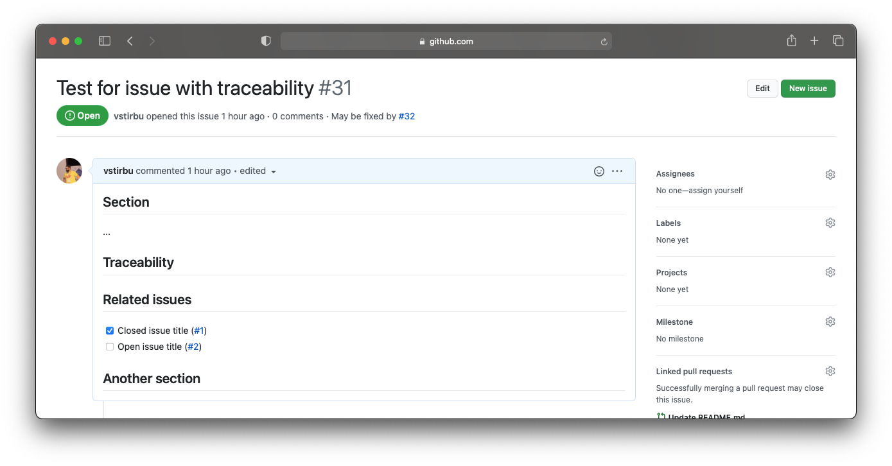
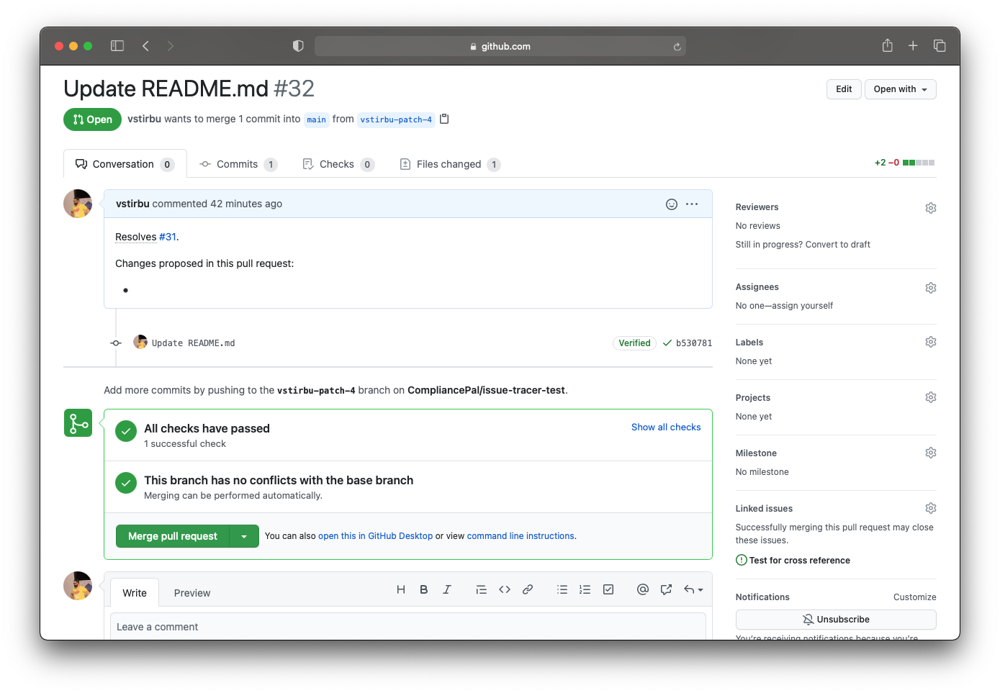

## Creating traced issues

An issue issue with traceability enabled will be updated automatically by the tracer action.

```markdown filename="Issue containing subtasks information updated by tracer"
## Section

...

## Traceability <!-- traceability -->

<!-- Section created by tracer. Do not edit -->

### Related issues

- [x] Closed issue title (#1)
- [ ] Open issue title (#2)
```



## Refining needs and defining subtasks

You can mark a requirement as a subtask by including in the issue's body a snippet indicating the parent issue number.

```markdown filename="An issue body metadata"
## Section

the issue body...

<!-- issue metadata at the end of the body, in yaml format -->

---

partOf: #{parentIssueNumber}

---
```

⚠️ Make sure that the parent issue exist and is enabled for traceability before marking an issue part of it.

## Resolving requirements

A pull request that follows the pull request [format](./configuration#configure-pull-request-template) will automatically link the pull request with the issue.


