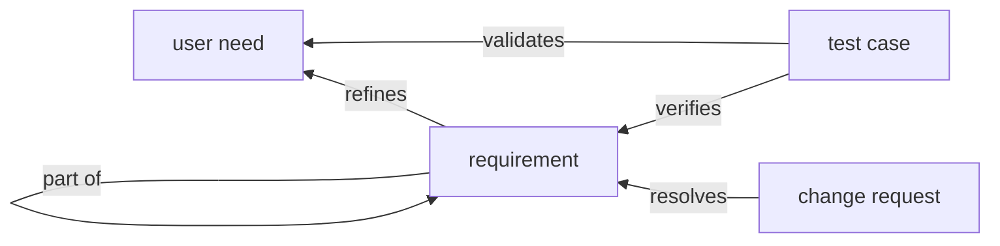
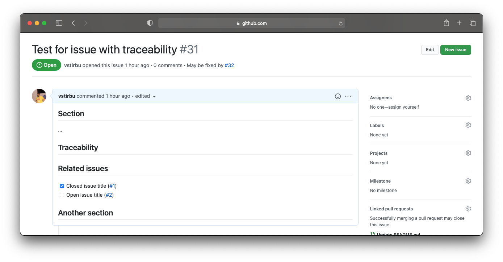
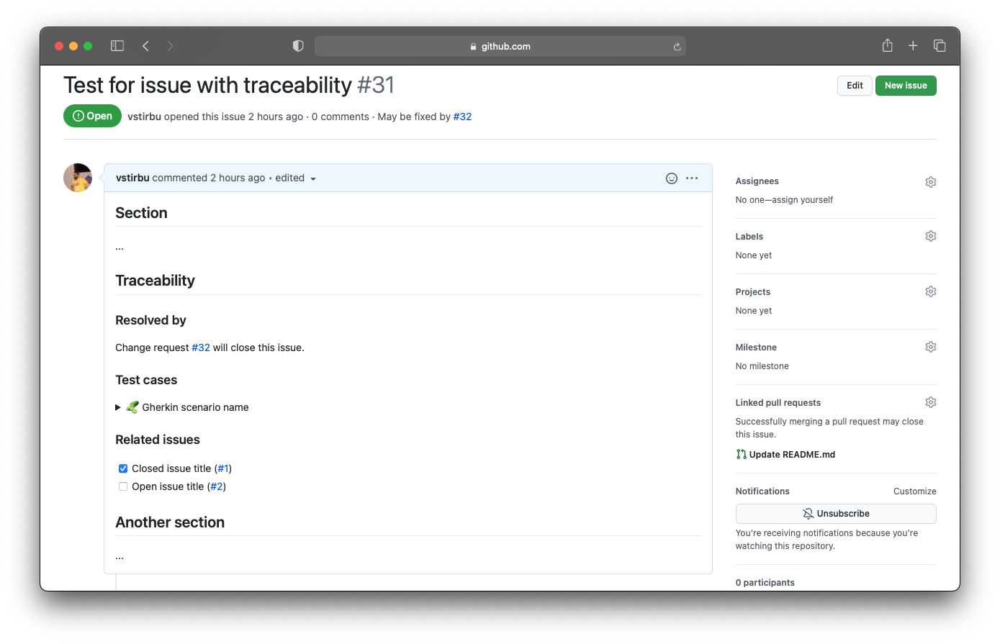

## Introduction

Traceability represents the ability to link the stakeholders' needs to the product requirements, and the requirements to the corresponding design artifacts, code and test cases.

## Terms

### User need

The top level requirements that define the intended use or purpose.

### Requirement

System and software requirements. System requirements refine the user needs, while the software requirements can be split into smaller parts.

### Test case

A test case is a specification of the inputs, execution conditions, testing procedures and the expected results. The test case is executed to achieve compliance with a specific requirement.

### Change request

A documented specification of a change to be made to the software.

## Information model



The information model is implemented using a combination of capabilities provided by GitHub, as follows:

| entity         | handled by   | implementation                   |
| -------------- | ------------ | -------------------------------- |
| user need      | GitHub       | issue tagged `need`              |
| requirement    | GitHub       | issue tagged `system`/`software` |
| test case      | manufacturer | gherkin feature                  |
| change request | GitHub       | pull request                     |

## Getting started

<!-- ### Setting the GitHub action

The following action must be added to the repository to enable the traceability.

```yaml title="Github workflow enabling issue tracing functionality"
name: Issue tracing
on:
  issues:
  pull_request:

jobs:
  trace:
    runs-on: ubuntu-latest
    steps:
      - uses: actions/checkout@v2
      - uses: CompliancePal/token-retriever@main
        id: retriever
        with:
          url: ${{ secrets.TOKEN_URL }}
      - uses: invisionapp/private-action-loader@v3
        with:
          pal-repo-token: ${{ steps.retriever.outputs.token }}
          pal-repo-name: CompliancePal/issue-tracer@main
        env:
          GITHUB_TOKEN: ${{ secrets.GITHUB_TOKEN }}
``` -->

### Enabling requirement tracing with issue templates

The following issue template enables tracing for all issues build from it. The template can have any structure. The `Issue Tracer` action maintains the traceability information under the section marked with the "heading" with `<!-- traceability -->`.

```markdown title="Issue template with enabled traceabiltity"
---
title: Issue with traceability
---

## Section

...

## Traceability <!-- traceability -->

<!-- Traceability content will be added here by Issue Tracer -->
```

Enabling the traceability with issue templates provides a consistent experience. With tracing enabled by default for all relevant issues, you avoid errors that can occur from manually crafting your issues.

⚠️ You must add at least one issue template configured for traceability in the repository.

### Resolve requirements with change requests

Marking which change request resolves a particular requirement is achieved using the GitHub's functionality of [cross references with keywords](https://docs.github.com/en/github/managing-your-work-on-github/linking-a-pull-request-to-an-issue#linking-a-pull-request-to-an-issue-using-a-keyword).

```markdown title="Pull request template with keyword cross reference"
Resolves #{requirementNumber}.

<!-- The rest of the template -->
```

⚠️ Pull requests must use a [pull request template](https://docs.github.com/en/github/building-a-strong-community/creating-a-pull-request-template-for-your-repository) to make the experience consistent, and eliminate human error.

## Usage

### Creating traced issues

An issue issue with traceability enabled will be updated automatically by the Trace Issue action.

```markdown title="Issue containing subtasks information updated by Issue Tracer"
## Section

...

## Traceability <!-- traceability -->

<!-- Section created by Issue Tracer. Do not edit -->

### Related issues

- [x] Closed issue title (#1)
- [ ] Open issue title (#2)
```



### Refining needs and defining subtasks

You can mark an requirement as a subtask by including in the issue's body a snippet indicating the parent issue number.

```markdown title="Issue body indicating that this requirement is a part of the indicated requirement"
## Section

the issue body...

<!-- issue metadata at the end of the body, in yaml format -->

---

partOf: #{parentIssueNumber}

---
```

⚠️ Make sure that the parent issue exist and is enabled for traceability before marking an issue part of it.

### Resolving requirements

A pull request that follows the pull request format will automatically link the pull request with the issue.


### Test case verifies requirement

Defining the test cases using the Gherkin syntax provides a way to make the test case understandable for non-programers and link it using tagging to the requirement that is verified by the test.

```gherkin title="Test case described as Gherkin scenario that verifies the tagged requirement", line_numbers
Feature: Cool functionality

        @issue-{number}
        Scenario: Verifies a requirement
            Given the scenario precondition
             When trigger stimulus
             Then this should happen
```

### All together

<!-- ```mermaid title="Implementing a new feature - a user journey"
journey
  section Planning
    Requirements: 5: PO
  section Development
    Branch: 3: Dev
    Test cases: 5: Dev
    Commits*: 3: Dev, Action
  section Review
    Pull request: 5: Dev
    Comments: 5: CO
    Commits*: 5: Dev, Action
  section Merge
    Release: 5: Dev, Action
``` -->

In the end, viewing an issue on the GitHub website shows the embedded report with the related issues, associated test cases and the change request that implements the requirement.


